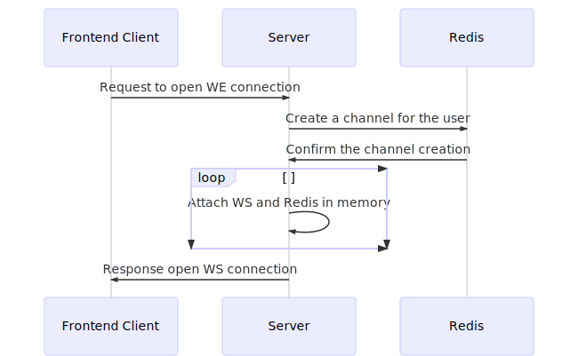
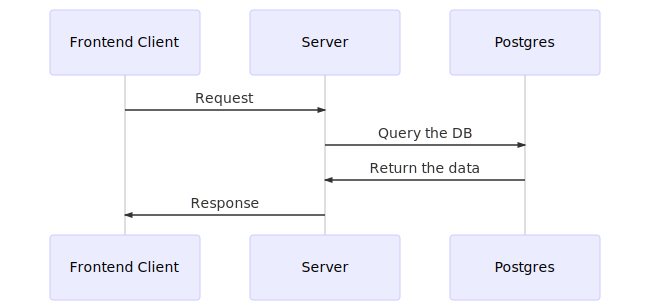
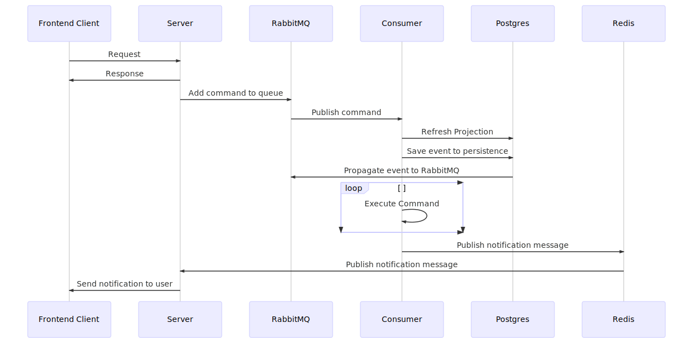

# Architecture

### On new open connection

<!--
    sequenceDiagram

    Frontend Client->>Server: Request to open WE connection
    Server->>Redis: Create a channel for the user
    Redis ->> Server: Confirm the channel creation
    loop
            Server ->> Server: Attach WS and Redis in memory
    end
    Server ->> Frontend Client: Response open WS connection
-->

When a new connection is open, the client will try to establish a WS connection with the server.

If the server already has a WS connection open with the user it will create a new connection for the current client, maintaining also the old one open.

### On HTTP query

<!--
    sequenceDiagram

    Frontend Client->>Server: Request
    Server->>Postgres: Query the DB
    Postgres->> Server: Return the data
    Server->> Frontend Client: Response
-->

When the client will try to execute a [query](https://en.wikipedia.org/wiki/Command-query_separation), an HTTP API call will be done.

The HTTP API call will return the required data, according to the standard that will be discussed later on.

The HTTP API calls MUST be handled as RESTish API calls.

### On HTTP command

<!--
    sequenceDiagram

    Frontend Client->>Server: Request
    Server->> Frontend Client: Response
    Server->>RabbitMQ: Add command to queue
    RabbitMQ->> Consumer: Publish command
    Consumer->> Postgres: Refresh Projection
    Consumer->> Postgres: Save event to persistence
    Postgres->> RabbitMQ: Propagate event to RabbitMQ
    loop
            Consumer ->> Consumer: Execute Command
    end
    Consumer ->> Redis: Publish notification message
    Redis->> Server: Publish notification message
    Server->> Frontend Client: Send notification to user
-->

When the client will try to execute a [command](https://en.wikipedia.org/wiki/Command-query_separation), an HTTP API call will be done.

The HTTP API call will always return an empty body.
All the commands will the executed as async jobs.

Once the command is applied, the server will communicate to the client that it can retrieve the changes.
The data sent to the WS will be done according to the standard that will be discussed later on.

Once the command has been published to the message broker (rabbitMQ), the consumer will receive it and handle it.

The consumer will always send the events to the event store for each domain event happening on the application.

The consumer will refresh the projection in the database.

The consumer will publish a new message to RabbitMQ if a new event is thrown.

The consumer will publish a new message to Redis if there is a notification to be sent to the client.

Redis will publish to the server with the subscribed client in order to send the notifications to the client.

Postgres will be used to [propagate events to RabbitMQ](https://github.com/subzerocloud/pg-amqp-bridge).